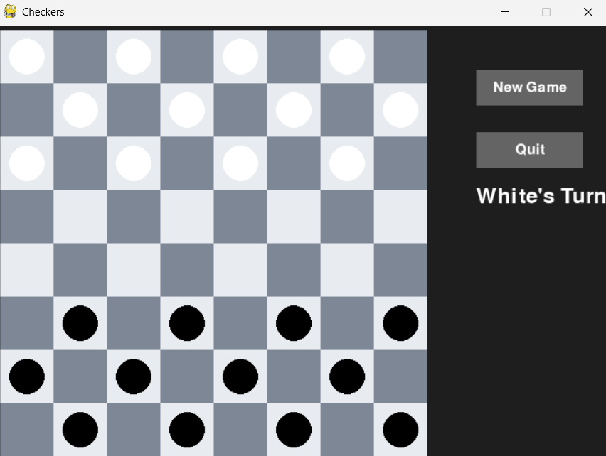

# Checkers with AI Engine

This project is a checkers game with an AI engine, written in Python. You can play against another human or the computer (AI), which uses Minimax or MCTS algorithms.

## Features

- Play checkers on a board of any even size (minimum 4x4)
- Game modes: human vs human, human vs AI (Minimax or MCTS)
- Graphical interface using Pygame
- Move animations and multi-capture support
- King (crowned piece) mechanics
- AI algorithms:
  - Minimax with alpha-beta pruning
  - Monte Carlo Tree Search (MCTS)

## Requirements

- Python 3.8+
- Pygame

Install required libraries with:
```
pip install -r requirements.txt
```

## How to Run

1. Make sure you have installed the required libraries.
2. Run `main.py`:
```
python3 main.py
```
3. Follow the on-screen instructions to choose board size and game mode.

## Project Structure

- `main.py` – game launcher
- `checkers.py` – game logic and AI
- `game.py` – gameplay and animation handling
- `gui.py` – graphical interface (Pygame)
- `requirements.txt` – required libraries

## Screenshot

Below is a screenshot of the game board:


